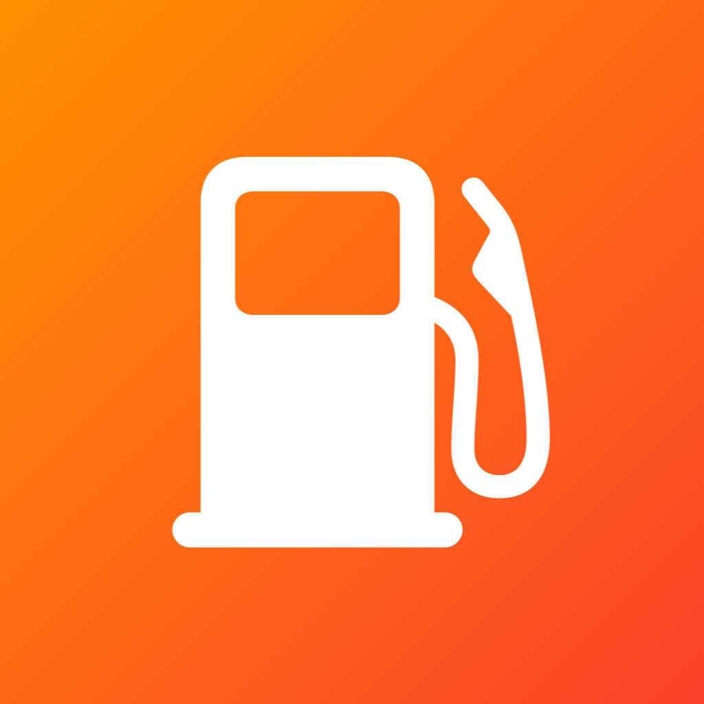

<div align="center">



# Carburante

**O diário de bordo da sua moto.** Registre abastecimentos em segundos, acompanhe o consumo real e mantenha o histórico de manutenção — tudo nativo, offline-first e em português.

iOS 18+ · SwiftUI · SwiftData · Supabase

</div>

---

## O que ele faz

- **Registro de abastecimento em poucos toques** — fluxo de foco progressivo, campos pré-preenchidos, data e localização capturadas sozinhas.
- **Consumo real pelo método full-to-full** — km/l calculado só entre dois tanques cheios, somando os abastecimentos parciais do intervalo. É o método correto, não a divisão ingênua entre registros consecutivos.
- **OCR de comprovante on-device** — a foto do cupom pré-preenche litros, valor e tipo de combustível via Vision, sem enviar imagem para lugar nenhum. Revisão manual antes de salvar é obrigatória.
- **Manutenção programada** — intervalos por km **e** por meses, alerta antes de vencer, Revisão Geral como serviço composto.
- **Garagem** — múltiplas motos, recordes pessoais, totais vitalícios, tema visual que muda conforme a marca da moto ativa.
- **Conquistas e níveis** — 25 medalhas com pontos por dificuldade.
- **Sync opcional** — funciona 100% offline; com Sign in with Apple os dados acompanham você entre dispositivos.

## Entrar no beta (TestFlight)

O app está em TestFlight. Quer testar? Mande um email para **contato@wagnerrosa.com** com o assunto *"Beta Carburante"* e eu te adiciono.

> Em breve um link público de inscrição aparece aqui, dispensando o email.

---

## Conquistas

25 medalhas. Pontos pesam por dificuldade e somam o nível do perfil — que é **só reconhecimento**: nenhuma medalha destrava funcionalidade.

| Medalha | Como desbloqueia | Pontos |
|---|---|:--:|
| 1º Abastecimento | 1 tanque cheio registrado | 1 |
| Primeira média | 2 tanques cheios — o primeiro km/l aparece | 2 |
| Na média | 3 tanques cheios — libera o gráfico de tendência | 4 |
| Abastecedor | 10 tanques cheios | 10 |
| 1ª Manutenção | primeira manutenção registrada | 2 |
| Acima da média | consumo acima da faixa típica da categoria da moto | 5 |
| **Marca** (10) | cadastrar uma Honda, Yamaha, BMW, Suzuki, Harley-Davidson, Royal Enfield, Ducati, Kawasaki, Triumph ou KTM | 1 cada |
| **Clube de cilindrada** (5) | 125 · 250 · 500 · 800 · 1000 — pela cilindrada da moto | 2 cada |
| **Categoria** (níveis) | scooter, trail, custom, street, sport, touring, off-road — nível 1 ao cadastrar, 2 aos 5.000 km, 3 aos 20.000 km | 1 / 3 / 6 |
| Iron Butt | 1.600 km em menos de 24 h — *em breve* | — |

A curva de níveis é íngreme de propósito: os primeiros vêm rápido para engajar, os últimos exigem coleção quase completa.

---

## Roadmap

O Carburante começa como registro de abastecimentos e caminha para ser o **passaporte digital da motocicleta**: o histórico pertence à moto, não ao dono.

> **A moto leva seus eventos. O usuário mantém sua história.**

Quando uma moto é vendida, o comprador recebe o histórico completo — manutenções, km, consumo — e cada registro continua marcado com quem o fez. Um histórico crível aumenta o valor da moto no mercado de usados.

| Fase | Entrega |
|---|---|
| **1 — MVP** ✅ | abastecimentos, consumo, OCR, manutenção, garagem, conquistas, sync |
| **2 — Fundação** | acesso escopado pela propriedade da moto; autoria imutável em cada evento |
| **3 — Transferência** | passar a posse da moto por código/QR, com o histórico junto |
| **4 — Perfil congelável** | quem vende mantém km e conquistas acumulados |
| **5 — Documentos** | nota fiscal, recibos e certificados ligados à moto |
| **6 — Verificabilidade** | prova de que o histórico não foi adulterado — sem blockchain |
| **7+** | consumo real vs. fábrica, contexto climático, diário da moto, viagens, comunidade |

As fases 2 a 6 têm dependência dura entre si: sem a fundação, transferir a moto não transferiria o histórico.

---

## Stack e decisões técnicas

| Camada | Escolha |
|---|---|
| UI | SwiftUI, SF Symbols, Swift Charts — **nativo puro**, sem biblioteca de UI externa |
| Persistência local | SwiftData (fonte de verdade; o app funciona sem rede) |
| Backend | Supabase — Postgres + RLS + Auth |
| OCR | Vision framework, **on-device** |
| Localização | CoreLocation + reverse geocoding |
| Auth | Sessão anônima desde o primeiro uso, promovida a Sign in with Apple sem migrar dado |
| Analytics | PostHog, com opt-out nos Ajustes |
| Testes | XCTest — **172 testes** sobre a lógica pura |

Algumas decisões que valem explicação:

**Lógica pura, separada da UI e do banco.** Consumo, validação, parser de OCR, agenda de manutenção, motor de medalhas e níveis são tipos puros sem dependência de SwiftData ou SwiftUI — por isso dá para testá-los direto. É o que sustenta os 172 testes.

**Offline-first de verdade.** SwiftData é a fonte local; o sync é bidirecional e aditivo, com resolução last-write-wins por linha. Uma edição feita offline nunca é sobrescrita por um pull.

**A propriedade da moto é uma entidade, não um campo.** `MotorcycleOwnership` modela o histórico de donos com início e fim — a base para a transferência da Fase 3.

**Exclusão é lógica, não física.** Registros apagados recebem um carimbo e somem da interface, mas persistem: o histórico da moto nunca é destruído por um toque errado.

**O OCR não tenta o impossível.** Display de bomba (7 segmentos) não é legível de forma confiável por OCR on-device — testado e descartado. O OCR mira o cupom impresso, onde funciona bem; o resto é digitação com revisão.

---

## Rodando o projeto

Requer Xcode 16+ e macOS com iOS 18 SDK.

```bash
git clone https://github.com/wagnerrosa/carburante.git
cd carburante

xcodebuild build -project Carburante/Carburante.xcodeproj \
  -scheme Carburante \
  -destination 'platform=iOS Simulator,name=iPhone 17'

xcodebuild test -project Carburante/Carburante.xcodeproj \
  -scheme Carburante \
  -destination 'platform=iOS Simulator,name=iPhone 17' \
  -only-testing:CarburanteTests
```

O schema do Postgres está em [`supabase/schema.sql`](supabase/schema.sql) — rode no SQL Editor do seu projeto Supabase e aponte `Services/SupabaseConfig.swift` para ele. As chaves versionadas são *publishable* / *project API key*, client-side por design e protegidas por RLS; chave secreta nunca entra no app.

A câmera só funciona em device físico — no simulador, teste o OCR pela galeria.

---

## Autor

**Wagner Rosa** — contato@wagnerrosa.com

Projeto pessoal, desenvolvido como estudo aprofundado de iOS nativo, arquitetura offline-first e modelagem de dados de longo prazo.
